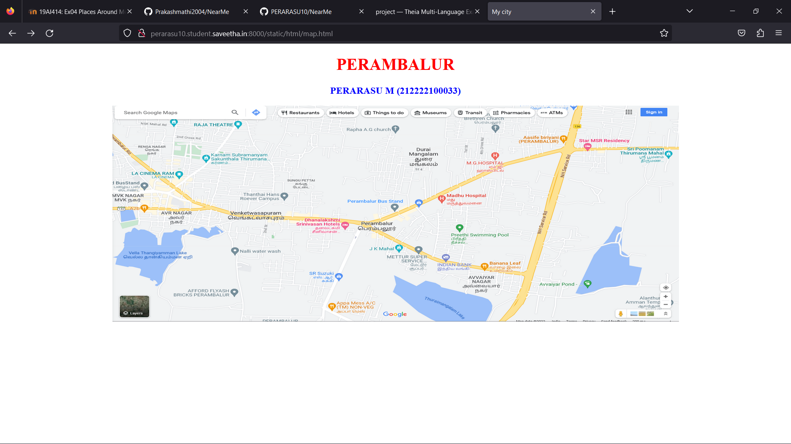
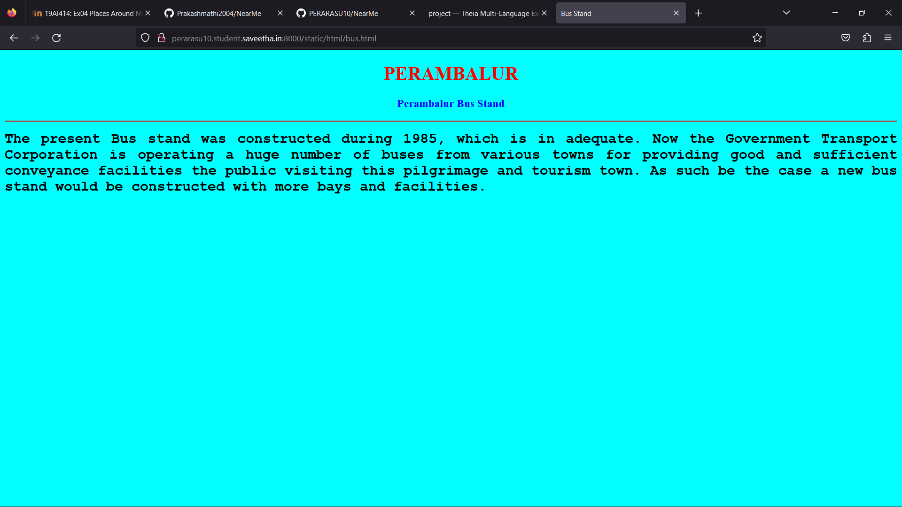
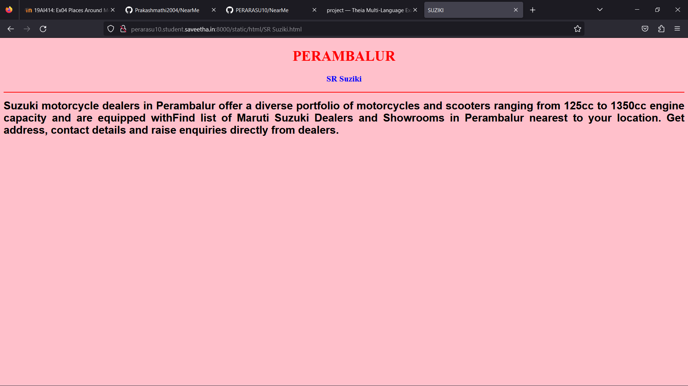
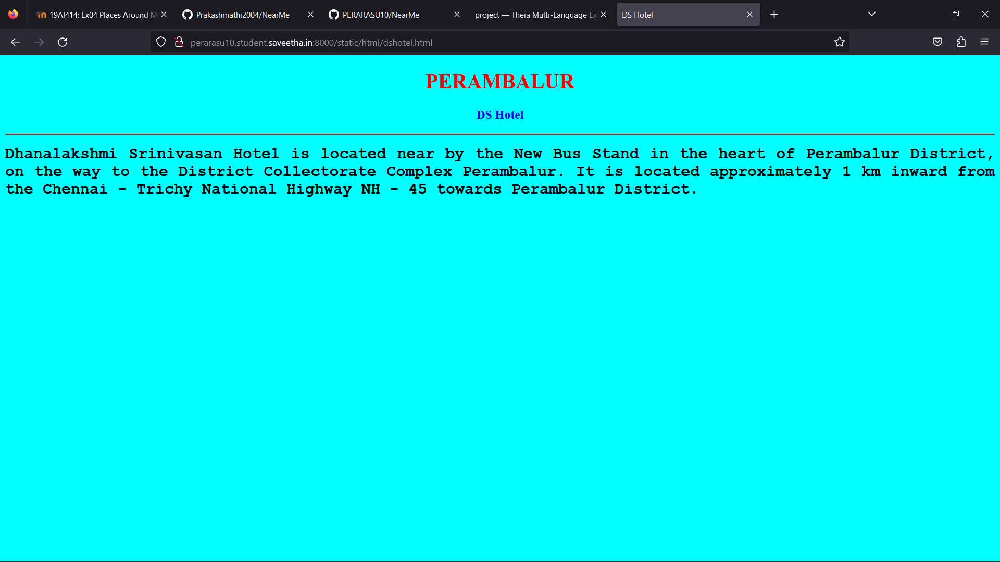
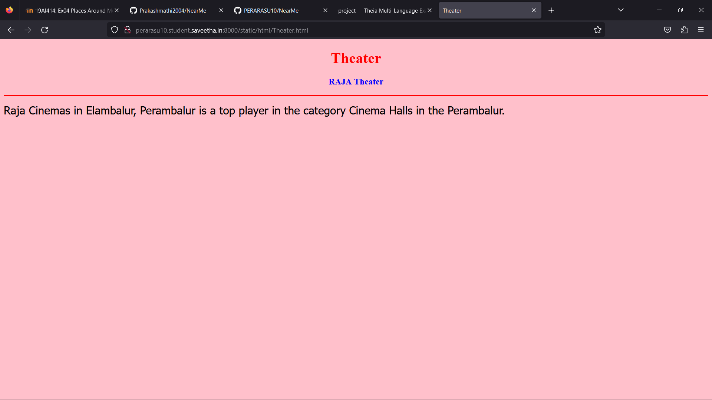
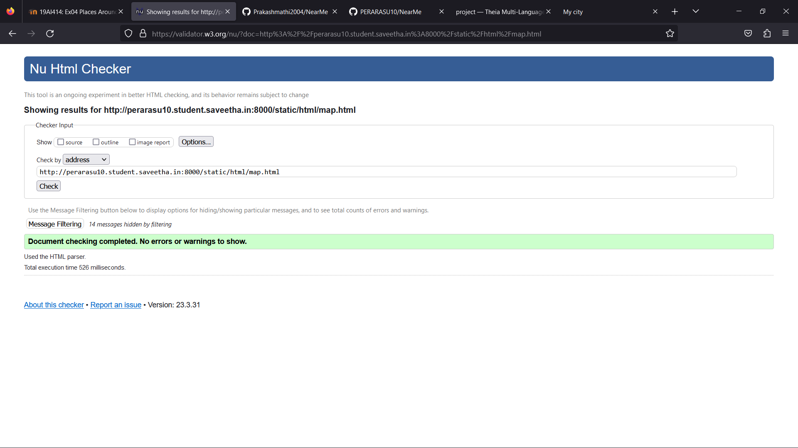

# Ex04 Places Around Me
## AIM
To develop a website to display details about the places around my house.

## DESIGN STEPS

### STEP 1
Clone the github repositary into theia IDE.

### STEP 2
Create a new django project.

### STEP 3
Write the needed HTML code.

### STEP 4
Run the django server and execute the HTML files.


## CODE
```
map.html

<!DOCTYPE html>
<html lang="en">
<head>
<title>My city</title>
</head>
<body>
<h1 align="center">
<font color="red"><b>PERAMBALUR</b></font>
</h1>
<h3 align="center">
<font color="blue"><b>PERARASU M (212222100033)</b></font>
</h3>
<center>

<map name="MyCity">
<area shape="circle" coords="540,180,50" href="bus.html" title="Bus Stand">
<area shape="rectangle" coords="230,30,260,60" href="Theater.html" title="Theater">
<area shape="circle" coords="400,350,50" href="SR Suziki.html" title="SUZIKI">
<area shape="circle" coords="400,230,60" href="dshotel.html" title="DS Hotel">

</map>
</center>
</body>
</html

bus.html

<!DOCTYPE html>
<html lang="en">
<head>
<title>Bus Stand</title>
</head>
<body bgcolor="cyan">
<h1 align="center">
<font color="red"><b>PERAMBALUR</b></font>
</h1>
<h3 align="center">
<font color="blue"><b>Perambalur Bus Stand</b></font>
</h3>
<hr size="3" color="red">
<p align="justify">
<font face="Courier New" size="5">
<b>
The present Bus stand was constructed during 1985, which is in adequate. Now the Government Transport Corporation is operating a huge number of buses from various towns for providing good and sufficient conveyance facilities the public visiting this pilgrimage and tourism town. As such be the case a new bus stand would be constructed with more bays and facilities.
</b>
</font>
</p>
</body>
</html>

dshotel.html

<!DOCTYPE html>
<html lang="en">
<head>
<title>DS Hotel</title>
</head>
<body bgcolor="cyan">
<h1 align="center">
<font color="red"><b>PERAMBALUR</b></font>
</h1>
<h3 align="center">
<font color="blue"><b>DS Hotel</b></font>
</h3>
<hr size="3" color="red">
<p align="justify">
<font face="Courier New" size="5">
<b>
Dhanalakshmi Srinivasan Hotel is located near by the New Bus Stand in the heart of Perambalur District, on the way to the District Collectorate Complex Perambalur. It is located approximately 1 km inward from the Chennai - Trichy National Highway NH - 45 towards Perambalur District. </b>
</font>
</p>
</body>
</html>

SR Suziki.html

<!DOCTYPE html>
<html lang="en">
<head>
<title>SUZIKI</title>
</head>
<body bgcolor="pink">
<h1 align="center">
<font color="red"><b>PERAMBALUR</b></font>
</h1>
<h3 align="center">
<font color="blue"><b>SR Suziki</b></font>
</h3>
<hr size="3" color="red">
<p align="justify">
<font face="Arial" size="5">
<b>
Suzuki motorcycle dealers in Perambalur offer a diverse portfolio of motorcycles and scooters ranging from 125cc to 1350cc engine capacity and are equipped withFind list of Maruti Suzuki Dealers and Showrooms in Perambalur nearest to your location. Get address, contact details and raise enquiries directly from dealers.
</b>
</font>
</p>
</body>
</html>

Theater.html

<!DOCTYPE html>
<html lang="en">
<head>
<title>Theater</title>
</head>
<body bgcolor="pink">
<h1 align="center">
<font color="red"><b>Theater</b></font>
</h1>
<h3 align="center">
<font color="blue"><b>RAJA Theater</b></font>
</h3>
<hr size="3" color="red">
<p align="justify">
<font face="Tahoma" size="5">
Raja Cinemas in Elambalur, Perambalur is a top player in the category Cinema Halls in the Perambalur. </font>
</p>
</body>
</html>

```

## OUTPUT











## HTML VALIDATOR



## RESULT
The program for implementing image maps using HTML is executed successfully.
